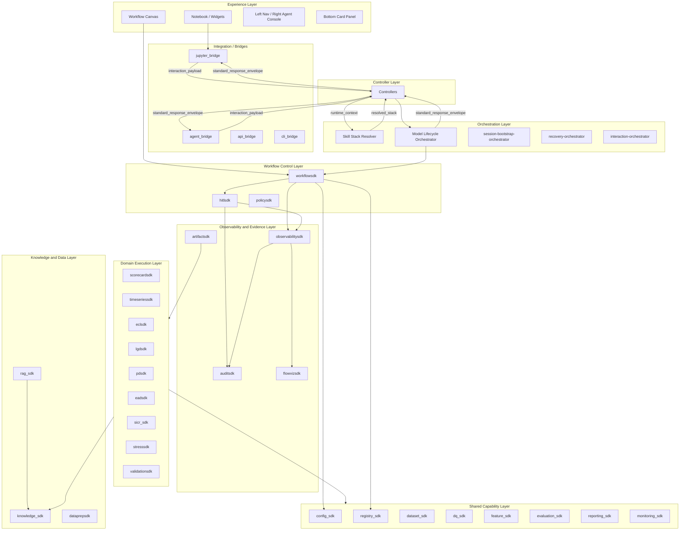
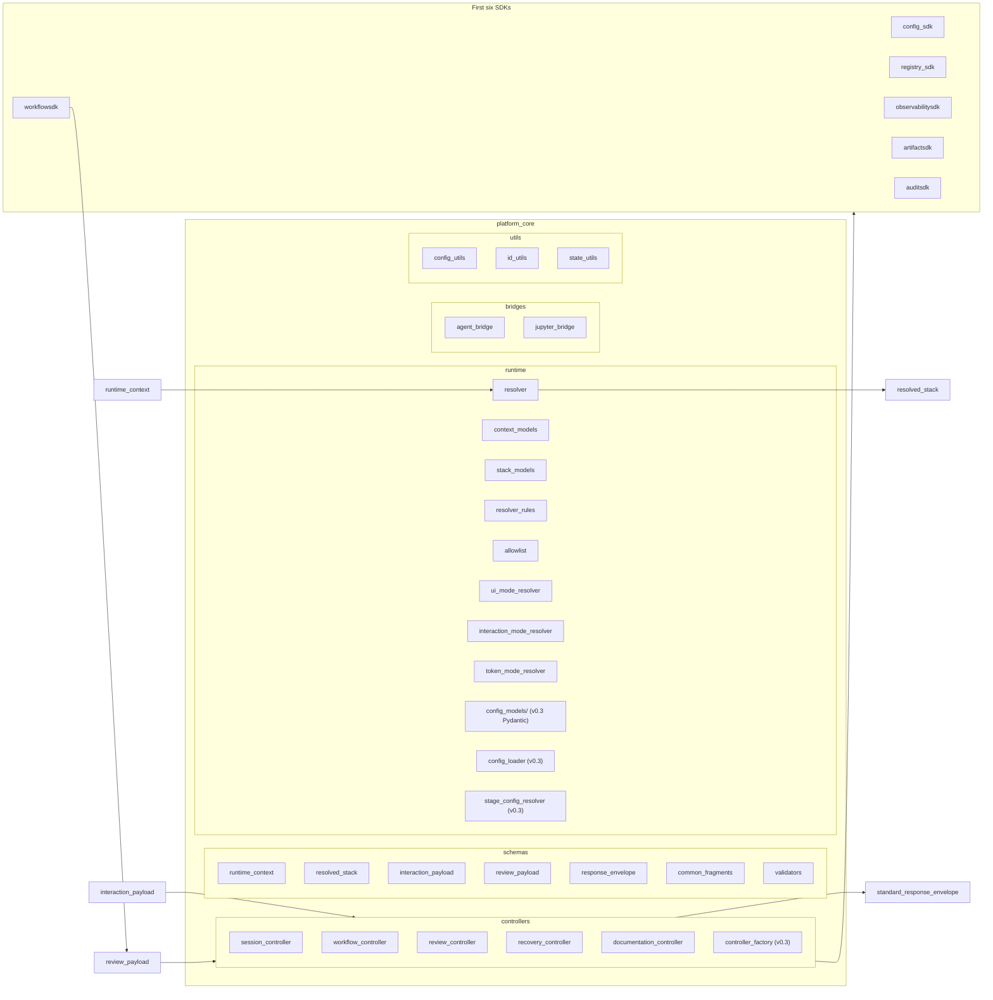
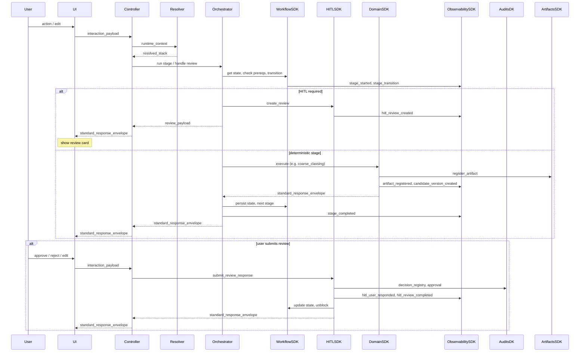

# Agentic AI Solution for Model Development Lifecycle -- Phased Action Plan

This plan re-prioritizes development to build **all platform infrastructure, governance, and utilities first**, making domain-specific SDKs an extensible layer plugged in last. Every payload and metadata schema is enriched for **regulatory audit trail, observability, and governance traceability**. Derived from the Reference folder URD set (v0.1, v0.2, v0.3) and the Agentic workflow design.

---

## Guiding Principles (Regulatory MDLC Focus)

- **Governance-first**: Every state mutation, decision, and artifact must be traceable to an actor, timestamp, stage, policy context, and rationale. No implicit transitions.
- **Audit-complete payloads**: All schemas carry `actor`, `timestamp`, `trace_id`, `run_id`, `session_id`, `stage_name`, `policy_context`, `evidence_refs`, and `correlation_id` as first-class fields -- not optional afterthoughts.
- **Config-driven runtime**: The entire runtime behavior (tool allowlists, governance gates, role capabilities, retry policies, stage routes) is data-driven via YAML configs validated by Pydantic models (enhancement v0.3). Zero hardcoded stage/role/tool logic.
- **Deterministic SDKs, governed orchestration**: SDKs do deterministic work; skills/orchestrators reason; humans decide at governance gates. No silent finalization, no implicit candidate selection.
- **Domain-agnostic core**: The platform shell (workflow, HITL, audit, observability, artifacts, policy, runtime resolver, controllers, bridges) is fully functional before any domain SDK exists. Domain SDKs plug into a well-defined contract.

---

## Architecture Summary

The platform is a **governed agentic operating system** for the model development lifecycle: deterministic SDKs perform calculations and transformations; skills (instruction stacks) orchestrate workflow, reasoning, and routing; humans remain accountable for governed decisions via HITL; logs and audit form the system of record; flow summarization provides visual interpretation. The architecture is **state-driven** (workflow state is source of truth), **explicit-selection** (no implicit candidate version selection), and **event-sourced** (append-only observability and audit).

---

### Layered architecture




---

### Build order (re-prioritized for governance-first)

```mermaid
flowchart TB
  subgraph p0 ["Phase 0: Foundation"]
    Schemas[Schemas and Contracts]
    PydanticCfg["Pydantic Config Models (v0.3)"]
    BaseClasses[Base Classes and Fragments]
    RepoStructure[Repo and Package Layout]
  end
  subgraph p1a ["Phase 1A: Core Utilities"]
    ConfigSDK_B[config_sdk]
    RegistrySDK_B[registry_sdk]
    ObsSDK[observabilitysdk]
    AuditSDK[auditsdk]
    ArtifactSDK[artifactsdk]
  end
  subgraph p1b ["Phase 1B: Workflow Engine"]
    WorkflowSDK_B[workflowsdk]
    StageRegistry[Stage Registry and Routing]
    SessionMgr[Session and Recovery]
  end
  subgraph p1c ["Phase 1C: HITL and Review"]
    HITLSDK_B[hitlsdk]
    ReviewPayloads[Review Payloads and Actions]
    DecisionCapture[Decision Capture]
  end
  subgraph p1d ["Phase 1D: Policy and Governance"]
    PolicySDK_B[policysdk]
    GovernanceEngine[Governance Overlay Engine]
  end
  subgraph p1e ["Phase 1E: Runtime and Controllers"]
    RuntimeCfgLoader[Runtime Config Loader]
    RuntimeResolver[Runtime Resolver Pack]
    ControllersPack[Controller Pack]
    BridgesPack[Agent and Jupyter Bridges]
  end
  subgraph p2 ["Phase 2: UX, Validation, Flow, RAG"]
    HITLUX[3-Panel Review UX]
    FlowViz[flowvizsdk]
    ValSDK[validationsdk]
    RAGKB["knowledge_sdk / rag_sdk"]
    SharedAnalytics["dq/feature/eval/reporting/monitoring SDKs"]
    APIBridgeP2["api_bridge / cli_bridge"]
  end
  subgraph p3 ["Phase 3: Domain SDKs and Canvas"]
    DomainContract[Domain Pack Contract]
    ScorecardSDK_B[scorecardsdk - reference impl]
    OtherDomains["ecl/lgd/pd/ead/sicr/stress/timeseries SDKs"]
    CanvasP3[Workflow Canvas]
    DataPrep[dataprepsdk]
  end
  p0 --> p1a --> p1b --> p1c --> p1d --> p1e --> p2 --> p3
```




---

### Layer responsibilities

- **Experience layer**: Jupyter notebooks and widgets (HITL cards, project/resume, flow panels); Workflow Canvas in main area (nodes, edges, stages, detail panel, export/print); left sidebar (workflow tree, page/card nav); right sidebar (agent console: Chat, Context, Actions, Trace); bottom panel (card-level controls). All UI talks to a **controller** that calls SDKs; no direct widget-to-skill coupling.
- **Bridges**: **jupyter_bridge** (widget_controller, action_dispatch, result_refresh); **agent_bridge** (tool_adapter, agent_context_builder, response_normalizer, retry_policy) exposing bounded SDK calls to the LLM; **api_bridge** and **cli_bridge** for REST and CLI access. Bridges enforce the standard result envelope and observability hooks.
- **Orchestration layer**: **Skill stack resolver** (enhancement v0.1) consumes **runtime_context** and returns **resolved_stack** (resolved_skills, sdk_allowlist, ui_contract, response_contract). **Model-lifecycle-orchestrator** resolves current stage, checks prerequisites, invokes stage skills/tools, triggers HITL when required, persists outcomes, coordinates resume/recovery. **Session-bootstrap-orchestrator** handles project discovery and resume prompts. **Recovery-orchestrator** recommends retry/rerun/rollback after failure. **Interaction-orchestrator** drives the HITL lifecycle (open review, process edits, recompute, finalize). **Controller layer** (session, workflow, review, recovery, documentation) receives **interaction_payload** and returns **standard_response_envelope**.
- **Workflow control layer**: **workflowsdk** owns workflow state, project bootstrap, routing_engine, stage_registry, transition_guard, session_manager, recovery_manager, candidate_registry, selection_registry, checkpoint_manager; blocks invalid transitions and blocks when mandatory review or selection is missing. **hitlsdk** builds review payloads, validates allowed_actions, captures decisions, manages review status and approval linkage. **policysdk** loads policy packs, evaluates thresholds and breach/approval rules; consulted by workflowsdk and hitlsdk for gating.
- **Observability and evidence layer**: **observabilitysdk** writes append-only events (skill/stage/hitl/candidate/artifact/workflow/recovery), trace_manager, replay_engine, lineage_builder; restricted actions are blocked if event write fails. **auditsdk** stores decision/approval/exception/signoff records with full audit fields; consumed by governance and export. **artifactsdk** registers every material output (artifact_id, type, stage, producer, version, uri, lineage); used by all producers and by reviews/findings for evidence. **flowvizsdk** turns events into FlowNode/FlowEdge and timeline for visualization and export.
- **Shared capability layer**: **config_sdk** and **registry_sdk** provide config load/validation and project/run/skill/policy/validation lookup. **dataset_sdk**, **dq_sdk**, **feature_sdk**, **evaluation_sdk**, **reporting_sdk**, **monitoring_sdk** provide reusable analytics and reporting; domain SDKs and validationsdk depend on these.
- **Domain execution layer**: Each **model type** has a domain SDK and a domain pack (stage_registry, routing_rules, metrics_pack, test_pack, artifact_pack, policy_pack, review_templates, skill_pack). Domain SDKs implement model-family logic, call feature_sdk and evaluation_sdk, register candidates and artifacts, and emit observability events. **validationsdk** is cross-domain: it runs the validation workflow (finding_registry, conclusion_engine, evidence_completeness) and uses workflowsdk/hitlsdk for validation-stage HITL with role separation from development. See **Model types and domain coverage** below for the full list.
- **Knowledge and data layer**: **knowledge_sdk** and **rag_sdk** implement the layered KB (global/domain/project/session), dual-store (structured registry + semantic retrieval), event-driven ingestion, promotion workflow, and token-thrifty retrieval (role/stage-aware, query_router, prompt_packager). **dataprepsdk** provides template-driven, Spark-first data preparation with full coverage of data structure types, grains, observation/target windows, splits, and lineage; see **Data preparation (dataprepsdk)** below.

---

### Enhancement v0.1 (Reference/enhancementv0.1)

Enhancement v0.1 defines a **runtime schema pack** and **payload flow** that the plan implements across phases:

- **Phase 0**: Five JSON schemas (runtime_context, resolved_stack, interaction_payload, review_payload, standard_response_envelope), common enums and reusable fragments, and **configs/** layout (platform/, sdk/, schemas/) per [Runtime context.md](Reference/enhancementv0.1/Runtime context.md) and [Folder structure.md](Reference/enhancementv0.1/Folder structure.md).
- **Phase 1**: **platform_core** (or equivalent): **runtime/** (context_models, stack_models, resolver, resolver_rules, allowlist, ui_mode_resolver, interaction_mode_resolver, token_mode_resolver); schema modules for the five schemas; **controllers/** (session, workflow, review, recovery, documentation); bridges (jupyter_bridge, agent_bridge) consume **interaction_payload** and return **standard_response_envelope**.
- **Phase 2**: End-to-end **payload flow** per [Payload flow pack.md](Reference/enhancementv0.1/Payload flow pack.md): runtime_context -> resolved_stack -> review_payload -> [human interaction] -> interaction_payload -> SDK layer -> standard_response_envelope. **Support skills** and **stage skills** per [Agent Skill Master.md](Reference/enhancementv0.1/Agent Skill Master.md). **UI modes** and **interaction modes** aligned with Runtime context enums. **SDK module dependency matrix** per [Module.md](Reference/enhancementv0.1/Module.md).

---

### Enhancement v0.2 (Reference/enhancementv0.2)

Enhancement v0.2 adds **base classes**, **function/signature discipline**, **file-by-file class mapping**, and **positioning** (Hybrid ADLC-SDLC):

- **Base classes (12)** per [Base classes.md](Reference/enhancementv0.2/Base classes.md): **BaseModelBase** (root for all typed models; to_dict, to_json, compact_dict, with_updates); **BaseResult** (status, message, sdk_name, function_name, data, warnings, errors, artifacts_created, references, agent_hint, workflow_hint, audit_hint, observability_hint; is_success, has_warnings, requires_human_review, recommended_next_action, recommended_next_stage); **ValidationResultBase** (extends BaseResult; is_valid, failed_rules, passed_rules; fail_count, pass_count, validation_summary); **BaseService** (_build_result, _get_dependency, _require_fields, _handle_exception, _log_start, _log_finish); **BaseStorageService**, **BaseRegistryService**, **BaseController**, **BaseBridge**, **BaseRuntimeComponent**, **BaseReviewComponent**, **BaseSparkService**, **BaseWidgetComponent**. Shared fragments: ArtifactRef, MetricResult, WarningRecord, ErrorRecord, ActorRecord, CandidateSummary, ReviewSuggestion in platform_core/schemas/common_fragments. Standalone utilities: ResultFactory, DependencyContainer, IDFactory, TimeProvider. Inheritance: shallow; composition for policy/artifact/event/audit.
- **Function signatures and return contract** per [Function signature.md](Reference/enhancementv0.2/Function signature.md): Layering (Core contracts -> Foundation SDKs -> Data/analytics SDKs -> Domain/lifecycle SDKs -> Bridges). Each SDK exposes typed models, one main service class, small set of public methods; material methods return **BaseResult** or **ValidationResult**. Every important method includes **agent_hint**, **workflow_hint**, **audit_hint**, **observability_hint**. Import order: stdlib -> third-party -> platform_core -> peer SDK -> local.
- **File-by-file class mapping** per [File by file.md](Reference/enhancementv0.2/File by file.md): File -> Class, Parent, Key Imports, Key Methods, Instantiated By, Depends On, Returns/Produces for platform_core and all SDKs.
- **MAS DLC positioning** per [(MAS) DLC.md](Reference/enhancementv0.2/(MAS) DLC.md): **Hybrid ADLC-SDLC Agentic AI MDLC Framework** -- SDLC builds the platform (SDKs, controllers, bridges, registries, Spark, widgets); ADLC governs agents (roles, skills, runtime resolution, tool routing, HITL); MDLC is the lifecycle automated (data prep, model dev, validation, approval, monitoring, remediation).

---

### Enhancement v0.3 (Reference/enhancementv0.3)

Enhancement v0.3 adds **Pydantic config schemas**, **data-driven YAML configs**, **runtime resolver implementation**, **controller pack skeleton**, **stage-by-stage orchestration**, **tool registry/allowlist**, and **function catalog**:

- **Pydantic config model pack** per [Pytanic Schema Design.md](Reference/enhancementv0.3/Pytanic Schema Design.md): 14 Python files under `platform_core/runtime/config_models/` with strong typing, strict validation, shallow nesting, reusable fragments, and a `RuntimeConfigBundle` with cross-file validators (A through K).
- **Data-driven YAML config pack** per [Data driven yaml.md](Reference/enhancementv0.3/Data driven yaml.md): 13 base YAML files plus overlay directories under `configs/runtime/`, loaded via `RuntimeConfigLoader` with merge semantics. Stage registry with 38+ stages from [Stage by stage orchestration.md](Reference/enhancementv0.3/Stage by stage orchestration.md).
- **Runtime resolver and allowlist** per [Runtime decision.md](Reference/enhancementv0.3/Runtime decision.md) and [Tools calling.md](Reference/enhancementv0.3/Tools calling.md): `RuntimeResolver` with sub-resolvers (RoleConfig, ToolGroup, Governance, Retry, Allowlist, UIMode, InteractionMode, TokenMode); tool access modes (READ_ONLY, BUILD_ONLY, REVIEW_REQUIRED, FINALIZATION_GATED, MONITORING_OPERATIONAL); global role clusters.
- **Controller pack** per [Python Code Skeleton - Controller Pack.md](Reference/enhancementv0.3/Python Code Skeleton - Controller Pack.md): BaseController, SessionController, WorkflowController, ReviewController, RecoveryController, ControllerFactory. Controllers are thin orchestration layers; business logic in SDK services.
- **Tool registry** per [Registry table.md](Reference/enhancementv0.3/Registry table.md) and **function catalog** per [Function catalog table.md](Reference/enhancementv0.3/Function catalog table.md).

---

### Connectivity diagram: base, child, and standalone classes by category

The following diagram shows the 12 base classes, their child classes, and standalone utilities by category, per [Base classes.md](Reference/enhancementv0.2/Base classes.md) and [File by file.md](Reference/enhancementv0.2/File by file.md). Arrows denote inheritance (child -> base). Standalone classes have no base in this hierarchy.

```mermaid
flowchart TB
  subgraph core [Core Contract]
    BaseModelBase[BaseModelBase]
    BaseResult[BaseResult]
    ValidationResultBase[ValidationResultBase]
    BaseResult --> BaseModelBase
    ValidationResultBase --> BaseResult
    RuntimeContext[RuntimeContext]
    ResolvedStack[ResolvedStack]
    InteractionPayload[InteractionPayload]
    ReviewPayload[ReviewPayload]
    StandardResponseEnvelope[StandardResponseEnvelope]
    RuntimeContext --> BaseModelBase
    ResolvedStack --> BaseModelBase
    InteractionPayload --> BaseModelBase
    ReviewPayload --> BaseModelBase
    StandardResponseEnvelope --> BaseResult
    ArtifactRef[ArtifactRef]
    MetricResult[MetricResult]
    WarningRecord[WarningRecord]
    ErrorRecord[ErrorRecord]
    ActorRecord[ActorRecord]
    ArtifactRef --> BaseModelBase
    MetricResult --> BaseModelBase
    WarningRecord --> BaseModelBase
    ErrorRecord --> BaseModelBase
    ActorRecord --> BaseModelBase
    ResultFactory[ResultFactory]
    DependencyContainer[DependencyContainer]
    IDFactory[IDFactory]
    TimeProvider[TimeProvider]
  end

  subgraph services [Service Layer]
    BaseService[BaseService]
    BaseStorageService[BaseStorageService]
    BaseRegistryService[BaseRegistryService]
    BaseReviewComponent[BaseReviewComponent]
    BaseSparkService[BaseSparkService]
    BaseStorageService --> BaseService
    BaseRegistryService --> BaseService
    BaseReviewComponent --> BaseService
    BaseSparkService --> BaseService
    ConfigService[ConfigService]
    RegistryService[RegistryService]
    ObservabilityService[ObservabilityService]
    ArtifactService[ArtifactService]
    AuditService[AuditService]
    WorkflowService[WorkflowService]
    PolicyService[PolicyService]
    HITLService[HITLService]
    ConfigService --> BaseService
    RegistryService --> BaseService
    ObservabilityService --> BaseService
    ArtifactService --> BaseService
    AuditService --> BaseService
    WorkflowService --> BaseService
    PolicyService --> BaseService
    HITLService --> BaseService
    ProjectRegistryService[ProjectRegistryService]
    RunRegistryService[RunRegistryService]
    ArtifactStorageAdapter[ArtifactStorageAdapter]
    EventStorageAdapter[EventStorageAdapter]
    ProjectRegistryService --> BaseRegistryService
    RunRegistryService --> BaseRegistryService
    ArtifactStorageAdapter --> BaseStorageService
    EventStorageAdapter --> BaseStorageService
    ReviewPayloadService[ReviewPayloadService]
    ActionValidationService[ActionValidationService]
    DecisionCaptureService[DecisionCaptureService]
    ReviewPayloadService --> BaseReviewComponent
    ActionValidationService --> BaseReviewComponent
    DecisionCaptureService --> BaseReviewComponent
    SparkDataPrepService[SparkDataPrepService]
    SparkDataPrepService --> BaseSparkService
  end

  subgraph ctrl [Controller Layer]
    BaseController[BaseController]
    SessionController[SessionController]
    WorkflowController[WorkflowController]
    ReviewController[ReviewController]
    RecoveryController[RecoveryController]
    SessionController --> BaseController
    WorkflowController --> BaseController
    ReviewController --> BaseController
    RecoveryController --> BaseController
  end

  subgraph bridge [Bridge Layer]
    BaseBridge[BaseBridge]
    AgentBridge[AgentBridge]
    JupyterBridge[JupyterBridge]
    APIBridge_C[APIBridge]
    CLIBridge_C[CLIBridge]
    MCPBridge[MCPBridge]
    AgentBridge --> BaseBridge
    JupyterBridge --> BaseBridge
    APIBridge_C --> BaseBridge
    CLIBridge_C --> BaseBridge
    MCPBridge --> BaseBridge
  end

  subgraph runtime [Runtime Layer]
    BaseRuntimeComponent[BaseRuntimeComponent]
    RuntimeResolver_C[RuntimeResolver]
    UIModeResolver[UIModeResolver]
    InteractionModeResolver[InteractionModeResolver]
    TokenModeResolver[TokenModeResolver]
    AllowlistResolver[AllowlistResolver]
    RoleConfigResolver[RoleConfigResolver]
    ToolGroupResolver[ToolGroupResolver]
    GovernanceRuleResolver[GovernanceRuleResolver]
    RetryPolicyResolver[RetryPolicyResolver]
    RuntimeResolver_C --> BaseRuntimeComponent
    UIModeResolver --> BaseRuntimeComponent
    InteractionModeResolver --> BaseRuntimeComponent
    TokenModeResolver --> BaseRuntimeComponent
    AllowlistResolver --> BaseRuntimeComponent
    RoleConfigResolver --> BaseRuntimeComponent
    ToolGroupResolver --> BaseRuntimeComponent
    GovernanceRuleResolver --> BaseRuntimeComponent
    RetryPolicyResolver --> BaseRuntimeComponent
    RuntimeRulesUtility[RuntimeRulesUtility]
  end

  subgraph ui [UI Layer]
    BaseWidgetComponent[BaseWidgetComponent]
    ReviewShell[ReviewShell]
    SelectionCards[SelectionCards]
    BootstrapCards[BootstrapCards]
    RecoveryCards[RecoveryCards]
    FlowPanels[FlowPanels]
    DetailPanels[DetailPanels]
    ValidationCards[ValidationCards]
    EvidencePanels[EvidencePanels]
    CommentCapture[CommentCapture]
    ActionBar[ActionBar]
    ReviewShell --> BaseWidgetComponent
    SelectionCards --> BaseWidgetComponent
    BootstrapCards --> BaseWidgetComponent
    RecoveryCards --> BaseWidgetComponent
    FlowPanels --> BaseWidgetComponent
    DetailPanels --> BaseWidgetComponent
    ValidationCards --> BaseWidgetComponent
    EvidencePanels --> BaseWidgetComponent
    CommentCapture --> BaseWidgetComponent
    ActionBar --> BaseWidgetComponent
  end
```




**Legend**

- **Core Contract**: BaseModelBase is root for all typed models; BaseResult and ValidationResultBase standardize SDK returns; payload and fragment models extend BaseModelBase or BaseResult. Standalone: ResultFactory, DependencyContainer, IDFactory, TimeProvider (no base).
- **Service Layer**: BaseService is root; BaseStorageService, BaseRegistryService, BaseReviewComponent, BaseSparkService extend it. ConfigService through HITLService are facade services (BaseService). ProjectRegistryService, RunRegistryService extend BaseRegistryService; ArtifactStorageAdapter, EventStorageAdapter extend BaseStorageService; ReviewPayloadService, ActionValidationService, DecisionCaptureService extend BaseReviewComponent; SparkDataPrepService extends BaseSparkService.
- **Controller Layer**: BaseController root; SessionController, WorkflowController, ReviewController, RecoveryController extend it (other domain controllers follow same pattern).
- **Bridge Layer**: BaseBridge root; AgentBridge, JupyterBridge, APIBridge, CLIBridge, MCPBridge extend it.
- **Runtime Layer**: BaseRuntimeComponent root; RuntimeResolver and all sub-resolvers (RoleConfig, ToolGroup, Governance, Retry, Allowlist, UIMode, InteractionMode, TokenMode) extend it. RuntimeRulesUtility is standalone (no base).
- **UI Layer**: BaseWidgetComponent root; ReviewShell, SelectionCards, BootstrapCards, RecoveryCards, FlowPanels, DetailPanels, ValidationCards, EvidencePanels, CommentCapture, ActionBar extend it.

For the full file-to-class mapping and additional SDK-specific classes, see [File by file.md](Reference/enhancementv0.2/File by file.md) sections B through M.

---

### Module-level architecture (enhancement v0.1)

The following diagram shows **design by modules** from [Folder structure.md](Reference/enhancementv0.1/Folder structure.md): **platform_core** and its subpackages, and how payloads flow between them and the first six SDKs.




- **runtime/**: Internal models for runtime state (context_models, stack_models); main resolver (input runtime_context, output resolved_stack); resolver_rules (role/domain/stage/overlay -> skills); allowlist (stage/domain/role -> sdk_allowlist); ui_mode_resolver, interaction_mode_resolver, token_mode_resolver. **New in v0.3**: config_models/ (Pydantic config model pack), config_loader (RuntimeConfigLoader), stage_config_resolver (StageConfigResolver).
- **schemas/**: Python models and validation for runtime_context, resolved_stack, interaction_payload, review_payload, standard_response_envelope; common_fragments (actor, artifact_ref, warning, error, metric_summary, etc.); validators for cross-field rules. JSON schema files live in configs/schemas/.
- **controllers/**: session_controller (create/resume session, load project, call resolver); workflow_controller (stage actions, coordinate workflowsdk); review_controller (load review_payload, accept interaction_payload, call interaction-orchestrator); recovery_controller (recovery choices, workflowsdk recovery); documentation_controller (drafting path). **New in v0.3**: controller_factory (instantiate controllers with service registry). Controllers invoke workflowsdk, hitlsdk, and other SDKs; return standard_response_envelope.
- **bridges/**: agent_bridge (context_builder, response_normalizer, tool_dispatcher, retry_policy); jupyter_bridge (widget_controller, notebook_state_sync, action_dispatch, result_refresh). Bridges sit between UI/agent and Controllers.
- **utils/**: config_utils, id_utils, datetime_utils, hash_utils, path_utils, json_utils, logging_utils, state_utils.

The first six SDKs (config_sdk, registry_sdk, observabilitysdk, artifactsdk, auditsdk, workflowsdk) are invoked by Controllers and Orchestrator; they consume and produce the same payload and envelope contracts.

---

### Model types and domain coverage

The platform supports multiple **model families** (Reference: Agentic workflow design 4.2-4.3, Sdk details 3, Validation agentic flow 4.3, DPACK-FR-003). Each model type is implemented by a **domain SDK** and a **domain pack** (stage_registry, routing_rules, metrics/test/artifact/policy packs, review templates, skills). The same workflow shell, meta-model, HITL engine, observability, and audit apply to all; only the domain-specific stages, artifacts, and skills differ.

**Initial scope (Phase 3 -- scorecard as reference implementation)**

- **Credit scoring (scorecard)**
  - **SDK**: scorecardsdk. **Domain pack**: scorecard (stage_registry, scorecard-specific metrics/tests/artifacts). **Domain skill**: scorecard-domain.
  - **Key stages**: intake, data_readiness, dq_review, eda, segmentation_review, fine_classing, coarse_classing, coarse_classing_review, binning_candidate_generation, binning_version_selection_review, selected_binning_finalization, woe_iv_review, feature_engineering, feature_screening, policy_variable_review, model_fitting, scaling_and_calibration, reject_inference_review, champion_challenger_review, model_review, validation_pack, committee_pack, deployment_readiness, deployment_approval, monitoring_pack, annual_review, closed.
  - **Key artifacts**: binning summaries, WoE tables, variable shortlist, model performance pack, score scaling pack, score bands. **HITL**: coarse classing review, binning version selection, feature shortlist, model selection, score scaling exception, deployment readiness, monitoring breach, annual review adverse finding.

**Extended scope (Phase 3)**

- **Time series**
  - **SDK**: timeseriessdk. **Domain pack**: timeseries. **Domain skill**: timeseries-domain.
  - **Concepts**: stationarity, lagging, differencing, cointegration, residual diagnostics, forecast horizon, scenario projection. **Artifacts**: stationarity test pack, lag config, residual diagnostics pack, forecast comparison pack. **Stage skills**: transformation-review, lag-selection-review, forecast-comparison, residual-diagnostics-review, model-selection, validation-conclusion.
- **ECL (IFRS 9)**
  - **SDK**: eclsdk. **Domain pack**: ecl. **Domain skill**: ecl-domain.
  - **Concepts**: staging, PD/LGD/EAD assembly, MEV sourcing and transformation, overlay, scenario weighting, forward-looking appropriateness. **Artifacts**: MEV pack, scenario pack, ECL outputs, overlay justification pack.
- **LGD (Loss Given Default)**
  - **SDK**: lgdsdk. **Domain pack**: lgd. **Domain skill**: lgd-domain.
  - **Concepts**: cure, severity, downturn adjustment, forward-looking adjustment, recovery timing.
- **PD (Probability of Default)**
  - **SDK**: pdsdk. **Domain pack**: pd. **Domain skill**: pd-domain.
  - **Concepts**: rating/score-based PD, calibration, term structure, transition logic, grade mapping.
- **EAD (Exposure at Default)**
  - **SDK**: eadsdk. **Domain pack**: ead. **Domain skill**: ead-domain.
  - **Concepts**: conversion factor, utilization, exposure profile, facility behavior.
- **SICR (Significant Increase in Credit Risk)**
  - **SDK**: sicr_sdk. **Domain pack**: sicr. **Domain skill**: sicr-domain.
  - **Concepts**: threshold rules, model-based SICR, rule-based SICR, migration logic.
- **Stress testing**
  - **SDK**: stresssdk. **Domain pack**: stress. **Domain skill**: stress-domain.
  - **Concepts**: scenario application, macro transmission, stressed outputs, severity interpretation.

**Cross-cutting workflows (all phases)**

- **Monitoring and annual review**: monitoring_sdk (shared). Skills: monitoring-agent, monitoring-breach-review, annual-review-outcome, annual-review-overlay. Post-deployment monitoring, drift/threshold breach triage, periodic review pack.
- **Remediation and redevelopment**: Skills: remediation-agent, remediation-overlay, issue-remediation-planner, remediation-closure. validationsdk: remediation_tracker.
- **Validation (independent challenge)**: validationsdk. Skills: validator-agent, validation-orchestrator, evidence-intake-review, methodology-challenge, model-fitness-advisor, validation-conclusion-drafter. Configurable per model type; findings, evidence completeness, model fitness advice, conclusion HITL; role separation (VAL-FR-011).

**Summary mapping**: Scorecard -> Phase 3. Time series / ECL / LGD / PD / EAD / SICR / Stress -> Phase 3. Monitoring/annual review -> Phase 2/3. Remediation -> Phase 2/3. Validation -> Phase 2.

---

### Data preparation (dataprepsdk)

The **dataprepsdk** (Reference: Data Prep SDK URD) is the governed, template-based, Spark-first layer for building model-ready training datasets. It supports multiple **data structure types**, **business grains**, **source modes**, **template families**, **target and observation logic**, **splits**, and **quality checks**, with full lineage and reproducibility.

**Data structure types**: Cross-sectional, Panel/longitudinal, Time series, Event/spell, Cohort snapshot, Repeated snapshot, Hierarchical linked, Macro-augmented supervised.

**Data grains and entities**: contract_reference, account_id, facility_id, application_id, entity_code/customer_id, customer-month, account-month, contract-month, default-event, observation date, reporting date, cohort date.

**Source modes**: (A) Pre-prepared -- source already mostly prepared. (B) Lineage-driven -- assemble from lineage config and source mappings.

**Template families**: cross_sectional_training_template, panel_training_template, time_series_training_template, event_history_training_template, cohort_snapshot_template, repeated_snapshot_template, hierarchical_join_template, macro_merge_template, target_alignment_template, train_test_oot_split_template.

**Splits**: development, validation, test, out-of-time, holdout, backtest. Styles: random, time-based, cohort-based, entity-based, policy-defined.

**Spark-first execution**: Material preparation runs in Spark; PySpark is the standard interface. Python-only for config, metadata, manifests, and orchestration. CML execution with S3 access (DPREP-FR-014).

---

### Request and event flow

Request path uses the five enhancement v0.1 payloads: **runtime_context**, **resolved_stack**, **interaction_payload**, **review_payload**, **standard_response_envelope**.




---

### Event flow (observability and audit)

**Observability events** (append-only): Orchestrator, DomainSDK, HITLSDK, and WorkflowSDK call observabilitysdk (log_event) for every material action. Main event types:

- **Skill**: skill_started, skill_completed, skill_failed
- **Stage**: stage_started, stage_completed, stage_failed, stage_transition
- **HITL**: hitl_review_created, hitl_user_responded, hitl_review_completed
- **Candidates and artifacts**: candidate_version_created, version_selection_created, artifact_registered
- **Workflow**: workflow_blocked, workflow_resumed, override_logged, rerun_requested
- **Recovery**: recovery_action_*
- **Governance** (v0.3): governance_gate_triggered, policy_evaluated, config_loaded

Flow: SDK/Orchestrator -> ObservabilitySDK (event_writer) -> event store; ReplayEngine and LineageBuilder read from event store for replay and lineage. Restricted actions are blocked if the mandatory observability write fails.

**Audit events**: HITLSDK writes to auditsdk (decision_registry, approval_registry, signoff_registry). Every response that represents a decision or approval carries **audit_ref** and **event_ref** in the **standard_response_envelope** for traceability.

---

### Skill stack resolution

Effective agent behavior is the **composition** of (Reference: Skills Stack):

1. **Platform base rules** (always on): no silent finalization, no implicit selection, all material actions logged, human sign-off only, workflow state as source of truth.
2. **Global orchestrator**: model-lifecycle-orchestrator (and bootstrap/recovery/interaction when active).
3. **Role skill**: developer-agent | validator-agent | governance-agent | documentation-agent | monitoring-agent | remediation-agent | reviewer-agent | approver-agent.
4. **Domain skill**: scorecard-domain | timeseries-domain | ecl-domain | lgd-domain | ...
5. **Stage skill**: coarse-classing-review | binning-version-selection | model-fitting-review | validation-conclusion | deployment-readiness | remediation-closure | ...
6. **Overlays** (optional): validation-pack-overlay | strict-governance-overlay | committee-pack-overlay | annual-review-overlay | material-change-overlay | remediation-overlay | ...
7. **Support skills** (optional): candidate-comparison-assistant | evidence-gap-detector | benchmark-comparison-assistant | artifact-readiness-checker | policy-breach-explainer | issue-severity-advisor | flow-summary-narrator.
8. **Session context** (injected at runtime): project_id, run_id, current_stage, pending_review, selected_candidate_version_id, warnings.

The resolver returns an **ordered list of skill identifiers** and a **tool allowlist** so the agent receives one combined instruction set and can only call permitted SDKs. Stage skills are narrow (current task, outputs, decision rules, HITL rules); they do not override platform safety or audit rules.

---

### Meta-model (canonical entities)

The platform shares a **canonical meta-model** across all model families:

- **Portfolio / program**: Program, Project, UseCase, DomainPack, PolicyPack. **Project** carries **model_family** / **domain_type** and references one active DomainPack and zero or more PolicyPacks.
- **Execution**: Workflow, Run, Session, StageExecution, CandidateVersion, VersionSelection, Rerun, RecoveryAction.
- **Review and decision**: Review, Approval, Decision, Exception, Override.
- **Evidence and output**: Artifact, Metric, TestResult, Recommendation, PolicyFinding.
- **Observability and viz**: Event, FlowNode, FlowEdge, TimelineEntry.
- **Identity**: User, Role, ReviewerAssignment.

Relationships: Project -> many Runs; Run -> many StageExecutions, CandidateVersions, VersionSelections, Reviews, Decisions, Events, Artifacts, FlowNodes, FlowEdges. Downstream stages consume the **selected** upstream version only; selection is explicit and recorded. **DomainPack** defines stage_registry, routing_rules, and artifact expectations for one model family (DPACK-FR-001, DPACK-FR-002).

---

### Key contracts

- **BaseResult and return contract** (v0.2): All material SDK public methods return **BaseResult** (or **ValidationResult** for validation-style methods). Includes agent_hint, workflow_hint, audit_hint, observability_hint. Controllers normalize to **standard_response_envelope** at the workflow boundary.
- **Standard result envelope**: status, message, run_id, stage_name, artifacts_created, candidate_version_id, selected_candidate_version_id, warnings, errors, review_created, **audit_ref**, **event_ref**, **governance_summary**, token_usage_hint.
- **Observability hook**: log_event(event_type, run_id, session_id, stage_name, actor_type, actor_id, summary, payload). Called by every SDK on material actions.
- **Artifact registration**: register_artifact(artifact_type, artifact_name, producer_stage, producer, version, uri_or_path, metadata).
- **Candidate and selection**: register_candidate_version(...), register_version_selection(...). Downstream is blocked if multiple candidates exist and no selection is recorded.
- **Review payload**: review_id, review_type, stage_name, title, decision_required, business_summary, technical_summary, recommendation, alternatives, allowed_actions, risk_flags, policy_findings, evidence_refs, review_status, **governance_requirements**, **sla_deadline**. **Bounded actions** only; free-text alone is not approval.
- **UI <-> backend**: Structured payload (interaction_payload) from UI; response envelope (standard_response_envelope) to UI.

---

### Design principles (recap)

- **Deterministic work** in SDKs/tools; **orchestration and reasoning** in skills; **accountable decisions** by humans via HITL.
- **State-driven**: workflow state is source of truth; routing and blocking use state, not chat history.
- **Explicit selection**: multiple candidates require an explicit VersionSelection; no implicit "latest."
- **Event-sourced**: append-only observability and audit; replay and lineage from events.
- **Flow summarization**: events -> FlowNode/FlowEdge/timeline for visualization and export.
- **Role separation**: development vs validation; validator-agent is advisory only, no automated sign-off.
- **Config-driven**: stage_registry, routing_rules, policy_pack, validation_pack, **governance_overlays** drive behavior; node types and actions are extensible via config/registry.
- **Multi-model**: The same workflow shell supports scorecard, time series, ECL, LGD, PD, EAD, SICR, stress testing, monitoring, annual review, and remediation via domain packs and domain SDKs; a new model type is added by introducing a new domain pack and SDK without redesigning the core (DPACK-FR-003, DPACK-NFR-001).

---

## Recommendation: One Repo, Multiple SDKs

**Use multiple SDKs, not a single monolith.** Benefits:

- **Ownership and versioning**: Each SDK can be owned, tested, and versioned with a clear surface.
- **Dependencies**: workflowsdk does not depend on scorecardsdk; domain SDKs depend on shared SDKs and contracts.
- **Extensibility**: New domains (e.g. stresssdk) add a package without touching core.
- **Reuse**: config_sdk, registry_sdk, artifactsdk, observabilitysdk are reused across all workflows.

**Keep everything in one project (monorepo)** so that shared contracts stay in sync, cross-SDK refactors and tests run in a single CI, and you can still install subsets (e.g. `pip install mdl-workflowsdk mdl-hitlsdk`) if packages are published separately.

---

## Project Structure (SDK-Oriented Monorepo)

Layout below maps the Reference SDK list into a single repo. Each SDK is a Python package under `sdk/`; shared platform shell lives in `sdk/platform_core`; JSON schema files live in `configs/schemas/`.

```
<repo_root>/
├── configs/
│   ├── platform/
│   │   ├── runtime_defaults.yml
│   │   ├── policy_modes.yml
│   │   ├── ui_modes.yml
│   │   └── token_budgets.yml
│   ├── runtime/                       # v0.3: Data-driven YAML config pack
│   │   ├── runtime_master.yaml
│   │   ├── tool_groups.yaml           # Groups A-H per v0.3 Tools calling.md
│   │   ├── role_capabilities.yaml     # developer/validator/monitoring/governance/approver/system
│   │   ├── ui_modes.yaml
│   │   ├── interaction_modes.yaml
│   │   ├── token_modes.yaml
│   │   ├── stage_registry.yaml        # All 38+ stages from Stage by stage orchestration.md
│   │   ├── stage_tool_matrix.yaml     # Per-stage allowed/blocked tool groups
│   │   ├── stage_preconditions.yaml
│   │   ├── governance_overlays.yaml   # Default rules + stage rules + role overrides + conditional rules
│   │   ├── retry_policies.yaml
│   │   ├── failure_routes.yaml
│   │   ├── workflow_routes.yaml
│   │   ├── domain_overlays/           # One YAML per domain (scorecard, ecl, etc.)
│   │   ├── role_overlays/             # One YAML per role
│   │   └── environment_overlays/      # dev.yaml, uat.yaml, prod.yaml
│   ├── sdk/                           # Per-SDK YAML configs
│   └── schemas/                       # Enriched JSON schemas (governance fields)
│       ├── workflow_state.schema.json
│       ├── hitl_review.schema.json
│       ├── skill_event.schema.json
│       ├── audit_event.schema.json
│       ├── artifact_registry.schema.json
│       ├── flow_node.schema.json
│       ├── flow_edge.schema.json
│       ├── runtime_context.schema.json
│       ├── resolved_stack.schema.json
│       ├── interaction_payload.schema.json
│       ├── review_payload.schema.json
│       └── standard_response_envelope.schema.json
│
├── sdk/
│   ├── platform_core/
│   │   ├── runtime/
│   │   │   ├── config_models/         # v0.3: Pydantic config model pack (14 files)
│   │   │   │   ├── base.py
│   │   │   │   ├── enums.py
│   │   │   │   ├── fragments.py
│   │   │   │   ├── runtime_master.py
│   │   │   │   ├── tool_groups.py
│   │   │   │   ├── roles.py
│   │   │   │   ├── ui.py
│   │   │   │   ├── stages.py
│   │   │   │   ├── governance.py
│   │   │   │   ├── retries.py
│   │   │   │   ├── routes.py
│   │   │   │   ├── domain.py
│   │   │   │   ├── environment.py
│   │   │   │   └── bundle.py          # RuntimeConfigBundle with cross-file validators
│   │   │   ├── config_loader.py       # v0.3: RuntimeConfigLoader
│   │   │   ├── stage_config_resolver.py  # v0.3: StageConfigResolver
│   │   │   ├── context_models.py
│   │   │   ├── stack_models.py
│   │   │   ├── resolver.py
│   │   │   ├── resolver_rules.py
│   │   │   ├── allowlist.py
│   │   │   ├── ui_mode_resolver.py
│   │   │   ├── interaction_mode_resolver.py
│   │   │   └── token_mode_resolver.py
│   │   ├── schemas/
│   │   ├── controllers/               # v0.3: controller_factory.py added
│   │   ├── bridges/
│   │   ├── utils/
│   │   └── pyproject.toml
│   │
│   ├── platform_contracts/
│   ├── config_sdk/
│   ├── registry_sdk/
│   ├── workflowsdk/
│   ├── hitlsdk/
│   ├── observabilitysdk/
│   ├── auditsdk/
│   ├── artifactsdk/
│   ├── flowvizsdk/
│   ├── policysdk/
│   ├── widgetsdk/
│   ├── validationsdk/
│   ├── dataset_sdk/
│   ├── dq_sdk/
│   ├── feature_sdk/
│   ├── evaluation_sdk/
│   ├── reporting_sdk/
│   ├── monitoring_sdk/
│   ├── scorecardsdk/
│   ├── timeseriessdk/
│   ├── eclsdk/
│   ├── lgdsdk/
│   ├── pdsdk/
│   ├── eadsdk/
│   ├── sicr_sdk/
│   ├── stresssdk/
│   ├── knowledge_sdk/
│   ├── rag_sdk/
│   ├── dataprepsdk/
│   ├── agent_bridge/
│   ├── api_bridge/
│   ├── cli_bridge/
│   ├── jupyter_bridge/
│   └── mcp_bridge/
│
├── skills/
│   ├── platform/
│   │   ├── platform-base-rules/
│   │   ├── model-lifecycle-orchestrator/
│   │   ├── session-bootstrap-orchestrator/
│   │   ├── recovery-orchestrator/
│   │   └── interaction-orchestrator/
│   ├── roles/
│   ├── domains/
│   ├── stages/
│   ├── overlays/
│   └── support/
│
├── config/
│   ├── stage_registry/
│   ├── routing_rules/
│   └── domain_packs/
│
├── apps/
├── notebooks/
├── tests/
├── pyproject.toml
└── README.md
```

**Package layout per SDK (example workflowsdk):**

```
sdk/workflowsdk/
├── pyproject.toml                 # name = "mdl-workflowsdk", deps = [platform_contracts, registry_sdk, ...]
├── src/
│   └── workflowsdk/
│       ├── __init__.py
│       ├── models.py
│       ├── service.py             # WorkflowService facade
│       ├── exceptions.py
│       ├── workflow_state.py
│       ├── project_bootstrap.py
│       ├── routing_engine.py
│       ├── stage_registry.py
│       ├── session_manager.py
│       ├── recovery_manager.py
│       ├── candidate_registry.py
│       ├── selection_registry.py
│       └── ...
└── tests/
```

**Dependency rules:**

- `platform_contracts` has no internal SDK deps (only stdlib + schema libs).
- **platform_core** may depend on `platform_contracts` and optionally `config_sdk`/`registry_sdk` for loading; it does not depend on domain SDKs. Controllers inside platform_core call workflowsdk, hitlsdk, and other SDKs; bridges depend on platform_core and the SDKs they expose.
- Core control SDKs (workflowsdk, hitlsdk, observabilitysdk, auditsdk, artifactsdk) depend on `platform_contracts`; they may depend on `config_sdk`, `registry_sdk`; they do not depend on domain SDKs.
- Domain SDKs depend on `platform_contracts`, `artifactsdk`, `observabilitysdk`, and shared SDKs (e.g. `feature_sdk`, `evaluation_sdk`).
- Bridges depend on platform_core and the SDKs they expose.
- Skills are files (SKILL.md), not Python packages; the resolver and orchestrator load them by path.

---

## Phase 0: Foundation, Contracts, and Pydantic Config Pack

**Goal**: Define every schema, contract, config model, and base class so all later phases share one language. Nothing is ambiguous at coding time.

### 0.1 Enriched JSON Schemas (Audit-First Metadata)

Every schema includes these **mandatory governance fields** (not optional):

```python
# Governance core fields (present in all material schemas)
project_id: str
run_id: str
session_id: str
trace_id: str          # distributed trace correlation
correlation_id: str    # links related operations
actor: ActorRecord     # who (id, role, display_name, delegation_chain)
timestamp: datetime    # ISO 8601 with timezone
stage_name: str
policy_context: PolicyContextRef  # active policy_mode, environment, domain
schema_version: str    # for backward compat
```

Schemas to define and version (in `configs/schemas/`):

- **workflow_state.schema.json**: project_id, run_id, session_id, current_stage, stage_status, completed_stages (with timestamps and actor), pending_stages, pending_reviews, blocking_reasons (structured: reason_code, description, blocking_since, resolution_path), artifact_registry_reference, approval_state (per-stage approval chain), last_successful_transition, active_candidate_versions, selected_versions, governance_flags, policy_violations_active, checkpoint_refs
- **hitl_review.schema.json**: review_id, review_type, stage_name, title, decision_required, business_summary, technical_summary, recommendation, alternatives, allowed_actions (bounded list), risk_flags (severity, category, evidence_ref), policy_findings (finding_id, severity, rule_ref, evidence_ref), evidence_refs (artifact_id, artifact_type, uri), review_status, reviewer_assignment (assigned_to, assigned_by, assigned_at, delegation_chain, sla_due_at), escalation_history, prior_review_refs, conditions_from_prior_approval
- **audit_event.schema.json**: audit_id, audit_type (decision, approval, exception, signoff, override, waiver, escalation), timestamp, actor, stage_name, run_id, project_id, trace_id, correlation_id, decision_payload (recommendation, rationale, evidence_refs, reviewer_action, reviewer_comment, conditions, selected_candidate_version_id, final_downstream_action), policy_context, skill_version, tool_version, preceding_audit_id (chain), environment, immutable flag
- **skill_event.schema.json**: event_id, event_type, timestamp, project_id, run_id, session_id, skill_name, skill_version, current_stage, trace_id, parent_event_id, actor, duration_ms, token_usage (prompt_tokens, completion_tokens, total_tokens), input_hash, output_hash, status, error_detail (if failed), artifacts_produced, governance_gate_hit (bool), review_created (bool)
- **artifact_registry.schema.json**: artifact_id, artifact_type, artifact_name, stage, producer_stage, producer_actor, version, uri_or_path, checksum (algorithm, value), created_timestamp, schema_version, project_id, run_id, source_candidate_version_id, lineage_parent_ids, storage_backend, retention_policy, access_control_ref, metadata (domain-extensible dict)
- **flow_node.schema.json** / **flow_edge.schema.json**: For flow summarization and governance visualization
- **session_resume.schema.json**, **stage_transition.schema.json**, **CandidateVersion**, **VersionSelection**, **policy_findings.schema.json**

Enhancement v0.1 runtime schemas (enriched):

- **runtime_context.schema.json**: All fields from v0.1 + `governance_flags`, `active_policy_violations`, `pending_remediation_actions`, `delegation_context`
- **resolved_stack.schema.json**: resolved_skills, sdk_allowlist, ui_contract, response_contract, **governance_constraints** (blocked_actions, mandatory_review_reasons, mandatory_audit_reasons)
- **interaction_payload.schema.json**: interaction_id, review_id, stage_name, interaction_type, action, actor, structured_edits, parameters, user_comment, attachments, timestamp, **policy_acknowledgments** (list of policy findings the actor has seen and acknowledged)
- **review_payload.schema.json**: proposal_summary, evidence, actions, structured_edit_schema, linked_refs, timestamps, **governance_requirements** (required_evidence, required_acknowledgments, sla_deadline)
- **standard_response_envelope.schema.json**: status, message, current_stage, next_stage, required_human_action, interaction_state, warnings, errors, artifacts_created, candidate_versions_created, selected_candidate_version_id, updated_metrics, review_created, validation_updates, workflow_state_patch, **audit_ref** (audit_id linking to audit record), **event_ref** (event_id linking to observability), **governance_summary** (policy_check_result, open_violations, blocking_reasons), token_usage_hint

### 0.2 Pydantic Config Model Pack (from enhancement v0.3)

Implement the full Pydantic schema hierarchy from [Pytanic Schema Design.md](Reference/enhancementv0.3/Pytanic Schema Design.md) in `platform_core/runtime/config_models/`:

- `base.py` -- `RuntimeConfigBase` (extra="forbid", validate_assignment, use_enum_values)
- `enums.py` -- All 13 enums: AccessModeEnum, UIModeEnum, InteractionModeEnum, TokenModeEnum, RuntimeModeEnum, UnknownBehaviorEnum, StaleStateBehaviorEnum, ReviewMissingBehaviorEnum, EnvironmentNameEnum, StageClassEnum, DomainEnum, ActorRoleEnum, RetryModeEnum
- `fragments.py` -- FileRefMap, EnabledModules, ResolverDefaults, StringListRule, RouteList, ToolListModel, StageRouteMap
- `runtime_master.py` -- RuntimeMasterSection, RuntimeMasterConfig
- `tool_groups.py` -- ToolGroupDefinition, ToolGroupsConfig, VirtualToolGroupDefinition, VirtualToolGroupsConfig
- `roles.py` -- RoleCapabilityDefinition, RoleCapabilitiesConfig, RoleOverlaySection, RoleOverlayConfig
- `ui.py` -- UIModeDefinition, UIModesConfig, InteractionModeDefinition, InteractionModesConfig, TokenModeDefinition, TokenModesConfig
- `stages.py` -- StageDefinition, StageRegistryConfig, StageToolMatrixEntry, StageToolMatrixConfig, StagePreconditionEntry, StagePreconditionsConfig
- `governance.py` -- DefaultGovernanceRules, StageGovernanceRule, RoleGovernanceOverride, ConditionalWhenClause, ConditionalThenClause, ConditionalGovernanceRule, GovernanceOverlaysSection, GovernanceOverlaysConfig
- `retries.py` -- RetryDefaults, ToolRetryRule, RetryPoliciesSection, RetryPoliciesConfig
- `routes.py` -- FailureRouteEntry, FailureRoutesConfig, WorkflowRoutesConfig
- `domain.py` -- DomainStageUIOverride, DomainStageToolAdditions, DomainOverlaySection, DomainOverlayConfig
- `environment.py` -- EnvironmentStrictness, EnvironmentRetries, EnvironmentBlockRules, EnvironmentUIDefaults, EnvironmentOverlaySection, EnvironmentOverlayConfig
- `bundle.py` -- **RuntimeConfigBundle** with cross-file validators (A through K per v0.3 design)

### 0.3 Data-Driven YAML Config Pack

Create the runtime YAML pack from [Data driven yaml.md](Reference/enhancementv0.3/Data driven yaml.md) under `configs/runtime/` (see Project Structure above).

Implement `RuntimeConfigLoader` and `StageConfigResolver`:

- `RuntimeConfigLoader`: load all YAML files in order, validate each via Pydantic model, merge overlays (domain -> role -> environment), return `RuntimeConfigBundle`
- `StageConfigResolver`: resolve effective config for a given stage/role/domain combination from the loaded bundle

### 0.4 Base Classes (12 + Standalone Utilities)

Per [Base classes.md](Reference/enhancementv0.2/Base classes.md), implement in `platform_core/`:

**Core contract** (`schemas/`):

- `BaseModelBase` -- root for all typed models (to_dict, to_json, compact_dict, with_updates)
- `BaseResult` -- status, message, sdk_name, function_name, data, warnings, errors, artifacts_created, references, **agent_hint**, **workflow_hint**, **audit_hint**, **observability_hint**
- `ValidationResultBase` -- extends BaseResult; is_valid, failed_rules, passed_rules
- Common fragments: `ArtifactRef`, `MetricResult`, `WarningRecord`, `ErrorRecord`, `ActorRecord`, `CandidateSummary`, `ReviewSuggestion`, `**PolicyContextRef`**, `**GovernanceSummary`**
- Payload models: RuntimeContext, ResolvedStack, InteractionPayload, ReviewPayload, StandardResponseEnvelope

**Service layer** (`services/`):

- `BaseService` -- _build_result, _get_dependency, _require_fields, _handle_exception, _log_start, _log_finish
- `BaseStorageService`, `BaseRegistryService`, `BaseReviewComponent`, `BaseSparkService`

**Controller/Bridge/Runtime/UI**:

- `BaseController` -- _resolve_runtime, _ensure_tool_allowed, _ensure_preconditions_passed, _build_response, _emit_event_if_needed, _write_audit_if_needed, _apply_workflow_patch_if_needed
- `BaseBridge` -- _normalize_payload, _normalize_result, _validate_interface_contract, _enforce_allowlist
- `BaseRuntimeComponent` -- resolve, _validate_runtime_context, _build_runtime_decision
- `BaseWidgetComponent` -- validate_props, build_component, register_callback, get_render_metadata

**Standalone utilities**: `ResultFactory`, `DependencyContainer`, `IDFactory`, `TimeProvider`

### 0.5 Common Enums and Reusable Fragments

Centralized enums (from v0.1 + v0.3): role_enum, domain_enum, workflow_mode_enum, ui_mode_enum, interaction_mode_enum, status_enum, review_status_enum, action_enum, severity_enum, conclusion_category_enum, access_mode_enum, stage_class_enum, retry_mode_enum, environment_enum, token_mode_enum. Document standard status enum for skills.

### 0.6 Repo Structure and Package Layout

SDK-oriented monorepo per existing plan, with v0.3 additions: `configs/runtime/` (full YAML config pack), `configs/schemas/` (enriched JSON schemas), `platform_core/runtime/config_models/` (Pydantic config model pack), `platform_core/runtime/config_loader.py`, `platform_core/runtime/stage_config_resolver.py`.

### 0.7 SDK Public API Discipline and Return Contract

Document and enforce per [Function signature.md](Reference/enhancementv0.2/Function signature.md):

- One main service class per SDK
- All material methods return `BaseResult` or `ValidationResultBase`
- Every return includes **agent_hint**, **workflow_hint**, **audit_hint**, **observability_hint**
- Controller boundary returns `StandardResponseEnvelope` with audit_ref and event_ref

### 0.8 Tool Registry Contract

Define the tool registry schema per [Registry table.md](Reference/enhancementv0.3/Registry table.md) and [Function catalog table.md](Reference/enhancementv0.3/Function catalog table.md): tool_name, backing_class_function, description, when_to_call, inputs, outputs, failure_modes, retry_mode, should_open_review, should_patch_workflow, audit_hook, event_hook, tool_type. Populate initial entries for Groups A-H.

### 0.9 Meta-Model Governance

Document meta-model governance (schema versioning, backward compatibility review, impact assessment on domain packs); META-FR-001 through META-NFR-001, VER-DR-001-002, WF-UR-001, OBS-OR-001, OBS-NFR-001, AUD-AR-001 coverage per Agentic workflow design.

---

## Phase 1A: Core Utility SDKs

**Goal**: Every SDK from this point forward has config loading, registry lookup, observability emission, audit recording, and artifact registration available as building blocks.

### 1A.1 config_sdk

Implement `ConfigService` with:

- `load_config(source, config_type, environment)` -- load YAML/JSON, apply environment overlay, return validated Pydantic model
- `validate_config(config, schema_name)` -- validate against Pydantic model or JSON schema
- `resolve_config(base_config, overlays)` -- merge base + domain + role + environment overlays per load order from v0.3
- `diff_config(old_config, new_config)` -- structured diff with material change flags (audit-worthy)
- `get_config_version(config)` -- hash-based version for reproducibility
- Structured audit logging for config loads, overrides, and default fallbacks

### 1A.2 registry_sdk

Implement `RegistryService` with:

- `register_project`, `get_project`, `register_run`, `get_run`, `search_registry`
- `register_skill_metadata`, `register_sdk_metadata`
- **Project registry**: project_id, project_name, portfolio, domain_type, model_family, created_by, created_at, policy_pack_ref, domain_pack_ref, status, governance_tier
- **Run registry**: run_id, project_id, workflow_type, run_status, started_at, completed_at, actor, environment, config_version_hash
- **Skill registry**, **Policy registry**, **Validation registry**

### 1A.3 observabilitysdk

Implement `ObservabilityService` with:

- `create_trace(context)` -- create trace with trace_id, parent linkage
- `write_event(event_type, payload, trace_id)` -- **append-only**, enriched with all governance core fields. Event types from [Stage by stage orchestration.md](Reference/enhancementv0.3/Stage by stage orchestration.md): skill_started/completed/failed, stage_started/completed/failed/transition, hitl_review_created/user_responded/review_completed, candidate_version_created, version_selection_created, artifact_registered, workflow_blocked/resumed, override_logged, rerun_requested, recovery_action_*, config_loaded, policy_evaluated, governance_gate_triggered
- `query_events(filters)` -- filter by run_id, stage, event_type, time_range, actor
- `replay_run(run_id)` -- reconstruct run timeline from events
- `build_event_lineage(run_id)` -- build DAG of event dependencies
- **Event store adapter** (pluggable: file, DB, S3) with write-ahead guarantee
- **Block restricted actions if mandatory event write fails** (OBS-FR-005)

### 1A.4 auditsdk

Implement `AuditService` with:

- `write_audit_record(audit_type, payload)` -- immutable, append-only. Types: decision, approval, exception, signoff, override, waiver, escalation, config_change
- `register_decision(decision_payload)` -- links to review_id, stage, actor, rationale, evidence_refs, selected_candidate_version_id, downstream_action, policy_context
- `register_approval(approval_payload)` -- links to review_id, approver (with delegation chain), conditions, timestamp, policy_rule_ref
- `register_exception(exception_payload)` -- deviation from policy with justification, waiver_ref (if waived), severity, expiry
- `register_signoff(signoff_payload)` -- final sign-off for stage/workflow closure, actor authority validation
- `export_audit_bundle(filters)` -- export full audit trail for a run/project/stage, formatted for regulatory review
- **Chained audit records**: each audit record has `preceding_audit_id` for full decision chain reconstruction
- **Tamper-evident**: checksum chain or append-only storage guarantee

### 1A.5 artifactsdk

Implement `ArtifactService` with:

- `register_artifact(artifact_payload)` -- with checksum, lineage_parent_ids, retention_policy, access_control_ref
- `get_artifact`, `locate_artifact`, `validate_artifact`
- `build_artifact_manifest(artifact_ids, manifest_type)` -- for reporting/committee packs
- `link_artifact_lineage(parent_ids, child_id, lineage_type)` -- preserve full lineage graph
- **Storage adapter** (S3, local, CML) with path resolution
- **Checksum manager** (SHA-256 by default) for integrity verification
- **Version resolver** for artifact versioning within a run

---

## Phase 1B: Workflow Engine (workflowsdk)

**Goal**: Full workflow state machine with stage routing, candidate management, checkpoints, and recovery.

### 1B.1 Workflow State Store

- Persist workflow state after every material stage completion, review response, version selection, and block event
- State includes all fields from enriched `workflow_state.schema.json`
- State mutations are event-sourced (every mutation emits an observability event and optionally an audit record)

### 1B.2 Project Bootstrap and Stage Registry

- `bootstrap_project_workflow(project_id, workflow_type, initial_context)` -- create project + run records, initialize state, select domain pack
- **Stage registry loader**: load from `configs/runtime/stage_registry.yaml`, validate via Pydantic `StageRegistryConfig`
- **Transition guard**: block invalid transitions; block when mandatory review pending; block when multiple candidates exist and no selection recorded

### 1B.3 Routing Engine

- `route_next_stage(run_id, current_stage, context)` -- resolve from `configs/runtime/workflow_routes.yaml` via Pydantic `WorkflowRoutesConfig`
- Route types: on_success, on_review_required, on_pass, on_fail, on_approved, on_rejected, on_auto_continue, on_remediation_required
- **Prerequisite enforcement**: check required_prior_stages, required_ids, required_refs, required_flags from `stage_preconditions.yaml`

### 1B.4 Candidate and Selection Registry

- `create_candidate_version(run_id, candidate_payload)` -- register with full metadata
- `select_candidate_version(run_id, candidate_version_id, rationale)` -- **mandatory audit record**, blocks if no review when policy requires
- Block downstream when multiple candidates and no explicit selection

### 1B.5 Session Manager and Recovery

- Session lifecycle: create, resume, suspend, close
- `validate_resume_state` -- workflow state integrity, artifact availability, approval validity, stage dependencies
- `resolve_recovery_path(run_id, failure_context)` -- recommend retry/rerun/rollback/resume with audit trail preservation
- **Checkpoint manager**: save/restore checkpoints at configurable points

---

## Phase 1C: HITL and Review (hitlsdk)

**Goal**: Full governed review lifecycle with bounded actions, decision capture, and audit integration.

### 1C.1 Review Lifecycle

- `create_review(review_type, review_payload, actor_context)` -- creates review record with SLA deadline, reviewer assignment
- `build_review_payload(review_type, source_context)` -- populates proposal_summary, evidence, actions, governance_requirements
- **Review status machine**: pending_review -> approved | approved_with_changes | rejected | rerun_requested | escalated
- **Escalation**: `escalate_review(review_id, reason, target_role)` with escalation_history tracking

### 1C.2 Action Validation

- **Bounded actions only**: approve, approve_with_changes, reject, rerun_with_parameters, request_more_analysis, escalate, drop_variable, approve_version, approve_version_with_overrides, create_composite_version
- **Reject free-text-only approval** -- structured decision required
- `validate_action(review_id, interaction_payload)` -- check actor has authority, action is in allowed_actions, policy acknowledgments present

### 1C.3 Decision Capture and Approval

- `capture_decision(review_id, action, interaction_payload)` -- writes to auditsdk, emits observability event, patches workflow state
- `approve_review` / `approve_with_conditions` -- records conditions, links to audit chain
- **Reviewer assignment**: assigned_to, assigned_by, delegation_chain, SLA tracking
- **Review templates** per stage type (configurable, loaded from YAML)

### 1C.4 Integration

- Integrates with workflowsdk (pause/resume at gated stages)
- Integrates with observabilitysdk (review events)
- Integrates with auditsdk (decision/approval/signoff records)
- Integrates with policysdk (determines whether review is mandatory)

---

## Phase 1D: Policy and Governance (policysdk)

**Goal**: Full policy evaluation engine driving HITL gates, approval requirements, escalation, and waivers.

### 1D.1 Policy Service

- `load_policy_pack(policy_mode, domain, stage)` -- load from governance_overlays.yaml + domain/role/environment overlays
- `evaluate_metric_set(metric_results, policy_pack)` -- classify pass/warn/breach per threshold
- `detect_breaches(evaluation_results, context)` -- identify policy violations, determine severity
- `get_stage_controls(stage_name, policy_pack)` -- returns review_required, approval_required, audit_required, auto_continue_allowed
- `requires_human_review(stage_name, context, policy_pack)` -- deterministic HITL trigger
- `get_approval_requirements(stage_name, context, policy_pack)` -- who can approve, authority level
- `can_actor_approve(actor, stage_name, policy_pack)` -- role-based authority check
- `should_escalate(context, policy_pack)` -- escalation trigger
- `is_waivable(issue_context, policy_pack)` -- waiver eligibility with audit

### 1D.2 Governance Overlay Engine

- Default rules + stage-specific rules + role overrides + conditional rules (from v0.3 Pydantic `GovernanceOverlaysConfig`)
- Conditional rules: when clauses (stage_access_mode_in, active_review_exists, approval_required, unresolved_severe_breach) -> then clauses (force_block_tools, force_allow_tools)
- Environment-aware strictness: prod enforces all gates; dev can relax some with audit log

---

## Phase 1E: Runtime Resolver, Controllers, and Bridges

**Goal**: Wire the full runtime resolution pipeline and controller orchestration layer.

### 1E.1 Runtime Resolver Pack

Per [Python Code Skeleton - Runtime Resolver.md](Reference/enhancementv0.3/Python Code Skeleton - Runtime Resolver.md):

- `RuntimeResolver.resolve(runtime_context)` -- orchestrates sub-resolvers, returns `ResolvedStack`
- `RoleConfigResolver` -- resolve role capabilities from `role_capabilities.yaml`
- `ToolGroupResolver` -- resolve allowed/blocked tool groups from `stage_tool_matrix.yaml`
- `GovernanceRuleResolver` -- resolve governance gates from `governance_overlays.yaml`
- `RetryPolicyResolver` -- resolve retry policy from `retry_policies.yaml`
- `AllowlistResolver` -- final tool allowlist after group + role + governance + domain overlay merge
- `UIModeResolver`, `InteractionModeResolver`, `TokenModeResolver` -- resolve UI contract

Runtime decision output shape (from [Runtime decision.md](Reference/enhancementv0.3/Runtime decision.md)):

```json
{
  "stage_name": "string",
  "actor_role": "string",
  "access_mode": "READ_ONLY|BUILD_ONLY|REVIEW_REQUIRED|FINALIZATION_GATED|MONITORING_OPERATIONAL",
  "preconditions_passed": true,
  "missing_preconditions": [],
  "allowed_tools": [],
  "blocked_tools": [],
  "review_required": false,
  "approval_required": false,
  "audit_required": false,
  "auto_continue_allowed": true,
  "recommended_ui_mode": "string",
  "recommended_interaction_mode": "string",
  "recommended_token_mode": "string",
  "governance_constraints": {},
  "recommended_next_routes": []
}
```

### 1E.2 Controller Pack

Per [Python Code Skeleton - Controller Pack.md](Reference/enhancementv0.3/Python Code Skeleton - Controller Pack.md):

- `BaseController` -- runtime resolution, tool allowance check, precondition check, response envelope builder, hook helpers (emit_event, write_audit, apply_workflow_patch)
- `SessionController` -- open_session, resume_session
- `WorkflowController` -- run_stage, route_next
- `ReviewController` -- open_review, get_review_payload, submit_review_action
- `RecoveryController` -- open_recovery_options, apply_recovery_choice
- `ControllerFactory` -- instantiate controllers with service registry
- All controllers: receive `interaction_payload`, call resolver, enforce allowlist, delegate to SDKs, return `standard_response_envelope` with audit_ref and event_ref

### 1E.3 Bridges (Minimal)

- **agent_bridge**: tool_adapter (bounded SDK exposure), agent_context_builder (compact state), response_normalizer, retry_policy
- **jupyter_bridge**: widget_controller, notebook_state_sync, action_dispatch, result_refresh

### 1E.4 Orchestrator Skills (Minimal)

- `model-lifecycle-orchestrator`: resolve stage, check prereqs, invoke tools, trigger HITL, persist outcomes
- `session-bootstrap-orchestrator`: project discovery, resume prompts
- `recovery-orchestrator`: failure inspection, recovery recommendation
- `platform-base-rules`: no silent finalization, no implicit selection, all material actions logged

### Phase 1 Exit Criteria

- **Full platform infrastructure operational** without any domain SDK
- Config loads and validates via Pydantic models from YAML
- Runtime resolver produces correct resolved_stack for any stage/role/domain combination
- Workflow state machine handles full lifecycle (create, transition, block, resume, recover)
- HITL creates reviews, validates bounded actions, captures decisions with full audit trail
- Observability events are append-only with trace correlation
- Audit records are immutable with chained references
- Artifacts register with checksums and lineage
- Policy engine gates stages correctly per governance overlays
- Controllers orchestrate the full flow: interaction_payload -> resolver -> SDK calls -> standard_response_envelope
- All of the above works with a **generic test domain** (no scorecard-specific logic needed)
- Integration tests: test_runtime_resolution, test_session_bootstrap_flow, test_artifact_audit_workflow, test_review_payload_flow, test_policy_gate_enforcement, test_workflow_full_lifecycle, test_controller_end_to_end

---

## Phase 2: UX, Validation, Flow Viz, RAG, and Shared Analytics

**Goal**: Visual flow, validation workstream, token-thrifty RAG, richer HITL UX, and shared analytical SDKs.

### 2.1 Flow Summarization (flowvizsdk)

- node_builder, edge_builder (events -> FlowNode/FlowEdge)
- flow_summary, timeline_builder, detail_linker, graph_export (JSON, HTML, SVG), flow_filters
- Consume observabilitysdk events; support drill-down to events and artifacts

### 2.2 Validation Workstream (validationsdk)

- validation_scope, evidence_intake, fitness_framework, finding_registry, conclusion_engine, remediation_tracker, evidence_completeness
- Validation stage skills with role separation (development vs validation)
- Configurable validation config packs per domain
- validator-agent skill, validation-conclusion stage skill, validation-orchestrator, evidence-intake-review, methodology-challenge, model-fitness-advisor

### 2.3 Knowledge and RAG (knowledge_sdk, rag_sdk)

- Knowledge object model, dual-store retrieval, token_budget_manager
- Document and workflow event ingestion, promotion workflow (project -> domain -> global)
- Role-aware and stage-aware retrieval, query_router, prompt_packager

### 2.4 3-Panel HITL UX (widgetsdk)

- review_shell, selection_cards, bootstrap_cards, recovery_cards, flow_panels
- **3-panel review workspace**: Panel A (proposal + evidence), Panel B (editable workspace), Panel C (actions/status)
- Standard payload/response flow aligned with resolved_stack ui_contract
- Post-edit validation (recompute -> valid_final | valid_with_warning | invalid_needs_review | blocked)
- UI modes: three_panel_review_workspace, validation_review_workspace, dashboard_review_workspace, bootstrap_workspace, recovery_workspace
- Interaction modes: edit_and_finalize, review_and_conclude, triage_and_disposition, review_and_approve, recovery_decision

### 2.5 Shared Analytical SDKs

- **dataset_sdk**: dataset_registry, snapshot_manager, split_manager
- **dq_sdk**: schema_checks, missingness, consistency, distribution_profile, business_rule_checks
- **feature_sdk**: transformation_engine, feature_metadata, feature_lineage
- **evaluation_sdk**: metric_engine, diagnostic_engine, comparison_framework, threshold_evaluator
- **reporting_sdk**: technical_report_builder, executive_summary_builder, committee_pack_builder, pack_assembler
- **monitoring_sdk**: drift_metrics, threshold_application, alert_engine, periodic_review_pack

### 2.6 API and CLI Bridges

- api_bridge (REST adapter, request/response mapper, auth_hooks)
- cli_bridge (command_router, argument_parser, output_formatter)

### 2.7 UI Panels and Sidebars

- Left sidebar workflow tree (4-tier: Workspace/Project, Module/Use Case, Page/Task, Card/Artefact); status badges, search/filter
- Right sidebar (Chat+Context+Trace+Actions)
- Bottom panel for active card controls
- Main area card-based review page with progressive disclosure

### 2.8 Additional Stage Skills and Overlays

- Stage skills: feature-shortlist-review, scaling-and-calibration-review, validation-scope-definition, methodology-review, model-fitness-review, monitoring-breach-review, annual-review-outcome, remediation-closure
- Overlays: validation-pack-overlay, strict-governance-overlay, committee-pack-overlay, annual-review-overlay, material-change-overlay, remediation-overlay
- Role skills: reviewer-agent, approver-agent

### Phase 2 Exit Criteria

- Flow visualization shows stage/agent/HITL/rerun/failure and links to events/artifacts
- Validation workflow runs with findings and conclusion HITL
- RAG retrieval is scoped and token-thrifty
- 3-panel HITL and standard payload/response contracts in use
- DQ, evaluation, monitoring, and reporting SDKs integrated
- Validation acceptance tests AT-VAL-001 through AT-VAL-017

---

## Phase 3: Domain SDKs, Canvas, Data Prep, and Scale

**Goal**: Plug in domain-specific model families via extensible domain pack contract; full Workflow Canvas; governed data preparation.

### 3.1 Domain Pack Contract (Extensible)

Define the contract so any new model family is added by:

1. Creating `configs/runtime/domain_overlays/<domain>.yaml`
2. Creating domain SDK under `sdk/<domain>sdk/`
3. Creating domain skill under `skills/domains/<domain>-domain/`
4. Creating stage skills under `skills/stages/`

Contract: stage_registry.yaml, routing_rules.yaml, metrics_pack, test_pack, artifact_pack, policy_pack, review_templates, skill_pack.

### 3.2 Scorecard (Reference Implementation)

- scorecardsdk as the first domain SDK proving the extensibility contract
- Modules: fine_classing, coarse_classing, binning_compare, woe_iv, feature_shortlist, logistic_models, score_scaling
- Full scorecard stages from session through monitoring/annual review
- Stage skills: coarse-classing-review, binning-version-selection, woe-iv-review, feature-shortlist-review, model-review, deployment-readiness
- Full scorecard domain overlay YAML

### 3.3 Other Domain SDKs

- timeseriessdk, eclsdk, lgdsdk, pdsdk, eadsdk, sicr_sdk, stresssdk
- Each follows the same domain pack contract

### 3.4 Workflow Canvas

- **Main-area canvas**: graph of nodes (task, approval, artefact, validation gate, agent step) and edges (depends_on, produces_input_for, approval_gate_to); layout: stage-based horizontal flow and DAG-style; zoom, pan, fit-to-screen, minimap
- **Node model**: title, type, status, progress, owner, last_updated; node states (not_started, queued, running, waiting_input, waiting_review, completed, completed_with_warning, failed, skipped, approved, rejected)
- **Node interaction**: click -> detail panel; context menu (open artefacts, rerun, retry, approve, reject, view logs, compare version)
- **Stages/groups**: headers (name, status, completion rate); collapse/expand; detail panel
- **Filters**: by status, stage, owner, run_id, approval status; search by title, id, stage, keyword
- **Export**: image snapshot, PDF summary, JSON state export, HTML snapshot; workflow snapshot; shareable deep links
- **History and versioning**: view by run/version; compare current vs prior; node version awareness
- **HITL on canvas**: states and actions per Canvas 9.2, 9.3
- **Governance/audit**: required audit fields, documentation evidence preservation, printed audit pack support
- **Data model entities**: Workflow, WorkflowRun, Stage, Node, Edge, Artefact, Approval, AuditEvent, Comment, Actor, ActionDefinition, WorkflowSnapshot, ExportManifest per Canvas 12.1-12.5
- Integration with left sidebar, right sidebar, bottom panel; event-driven refresh; JupyterLab integration

### 3.5 Data Preparation (dataprepsdk)

- Template-driven, Spark-first, governed data preparation
- template_registry, template_executor, config_validator, lineage_resolver
- Templates: cross_sectional, panel, time_series, event_history, cohort_snapshot
- Config sections: project_info, source_registry, lineage_mapping, grain_definition, entity_definition, time_definition, target_definition, feature_definition, split_definition, quality_rules, output_definition
- Lineage, quality checks, reproducibility
- CML execution with S3 access

### 3.6 Token Optimization

- Runtime-compressed skill views, state-delta injection
- Context pack builders (routing, review, validation, drafting)
- Retrieval filters, top-k discipline, token budget per mode, usage telemetry

### 3.7 Skills Folder Structure

- Create and populate full skills folder (platform/, roles/, domains/, stages/, overlays/, support/)
- Support skills: candidate-comparison-assistant, evidence-gap-detector, benchmark-comparison-assistant, artifact-readiness-checker, policy-breach-explainer, issue-severity-advisor, flow-summary-narrator, technical-report-drafter, executive-summary-drafter, validation-note-drafter, audit-response-assistant
- Stage skills from enhancement v0.1: data-readiness-review, data-validation-review, implementation-validation-review, monitoring-snapshot-ingestion, monitoring-metric-generation, monitoring-action-assignment, committee-pack-preparation, documentation-pack-preparation, issue-remediation-planner
- All skills have SKILL.md with template (purpose, when to use, inputs/outputs, must do/must not do, HITL rules, observability/audit)

### 3.8 MCP Bridge

- mcp_bridge (mcp_tool_registry, mcp_request_mapper, mcp_response_mapper) for future MCP-compatible agent tooling

### 3.9 Advanced Canvas and Governance

- Timeline overlay and execution trace view; version comparison (run vs run)
- Role-aware view modes; approval nodes and approval trace
- Exportable audit summary and documentation evidence preservation
- Lazy loading/virtualization for large graphs; incremental updates; deep links
- UI UX Phase 2 (compare mode, inline AI actions, approval statuses, version tagging, audit trail viewer) and Phase 3 (evidence drawer, export workflows, session timeline, role-based views)

### Phase 3 Exit Criteria

- Workflow Canvas is the main-area cockpit with nodes, edges, stages, filters, export/print/snapshot
- At least two domain packs (e.g. scorecard + time series or ECL) run on shared shell
- dataprepsdk produces governed training datasets
- Token usage is measured and thrifty
- Validation framework and audit export support governance and committee use
- Full governance test matrix passes

---

## Cross-Phase: Governance Testing Matrix

For regulatory MDLC, governance tests are first-class:

- **Audit completeness**: Every decision, approval, exception, and signoff has a linked audit record with full metadata
- **Policy enforcement**: Stages requiring review cannot auto-continue; stages requiring approval cannot proceed without authorized approver
- **Immutability**: Audit and observability records are append-only; tampering is detectable
- **Lineage**: Every artifact traces to its producing stage, actor, config version, and candidate version
- **Role separation**: Validator cannot approve their own development work
- **Recovery preservation**: Recovery actions preserve full audit trail of what failed and why
- **Reproducibility**: Config hash + artifact lineage + event replay can reconstruct any run
- **Delegation**: Approval delegation chains are recorded and auditable

---

## Cross-Phase Dependencies


| Deliverable           | Depends on                                                         |
| --------------------- | ------------------------------------------------------------------ |
| HITL widgets          | hitlsdk, workflowsdk, controller, schemas                          |
| Flow viz              | observabilitysdk events, flowvizsdk, widgetsdk                     |
| Validation workstream | workflowsdk, hitlsdk, validationsdk, role separation               |
| RAG/KB                | knowledge_sdk, rag_sdk, event ingestion, retrieval filters         |
| Workflow Canvas       | flow nodes/edges, state, observability, JupyterLab integration     |
| Multi-domain          | domain_pack contract, shared meta-model, stage_registry per domain |


---

## Key Files and Locations

- **Pydantic config models**: `sdk/platform_core/runtime/config_models/` (14 files per v0.3)
- **YAML config pack**: `configs/runtime/` (13 base files + overlay directories)
- **JSON schemas**: `configs/schemas/` (enriched with governance fields)
- **Base classes**: `sdk/platform_core/schemas/`, `sdk/platform_core/services/`, `sdk/platform_core/controllers/`
- **Runtime resolver**: `sdk/platform_core/runtime/` (resolver, sub-resolvers, config_loader, stage_config_resolver)
- **Controller pack**: `sdk/platform_core/controllers/` (base + session/workflow/review/recovery + factory)
- **Tool registry**: `configs/runtime/tool_groups.yaml` + `configs/runtime/stage_tool_matrix.yaml`
- **Function catalog**: Derived from [Function catalog table.md](Reference/enhancementv0.3/Function catalog table.md) -- implemented as SDK service methods
- **SDK list coverage**: All 33 SDKs in [Reference/sdk_list.txt](Reference/sdk_list.txt). **A (Core)**: workflowsdk, hitlsdk, observabilitysdk, auditsdk, artifactsdk, flowvizsdk, policysdk, widgetsdk. **B (Shared platform)**: config_sdk, registry_sdk, dataset_sdk, knowledge_sdk, rag_sdk. **C (Shared analytical)**: dq_sdk, feature_sdk, evaluation_sdk, reporting_sdk. **D (Data engineering)**: dataprepsdk, monitoring_sdk. **E (Domain)**: scorecardsdk, timeseriessdk, eclsdk, lgdsdk, pdsdk, eadsdk, sicr_sdk, stresssdk. **F (Validation)**: validationsdk. **G (Bridges)**: agent_bridge, api_bridge, cli_bridge, jupyter_bridge, mcp_bridge.
- **Skills**: `skills/platform/`, `skills/roles/`, `skills/domains/`, `skills/stages/`, `skills/overlays/` per [Skills Stack.md](Reference/Skills Stack.md).
- **UI**: 4-region layout per [UI UX Planning.md](Reference/UI UX Planning.md); 3-panel HITL per [UX URD.md](Reference/UX URD.md); Canvas FRs per [Workflow Canvas.md](Reference/Workflow Canvas.md).
- **Validation**: requirement matrix in [Validation agentic flow.md](Reference/Validation agentic flow.md) (VAL-FR-001 through VAL-NFR-002).
- **Enhancement v0.1**: [Reference/enhancementv0.1](Reference/enhancementv0.1) -- Runtime context, Payload flow pack, Agent Skill Master, Module, Folder structure.
- **Enhancement v0.2**: [Reference/enhancementv0.2](Reference/enhancementv0.2) -- Function signature, File by file, Base classes, (MAS) DLC.
- **Enhancement v0.3**: [Reference/enhancementv0.3](Reference/enhancementv0.3) -- Pytanic Schema Design, Data driven yaml, Stage by stage orchestration, Tools calling, Runtime decision, Registry table, Function catalog table, Python Code Skeleton - Controller Pack.

---

## Risk Mitigations

- **Over-automation**: Mandatory HITL at configured gates; bounded reviewer actions; no free-text-only approval.
- **Missing observability**: Append-only logs; block restricted actions if logging fails.
- **Ambiguous workflow**: Explicit routing rules; structured workflow state; block when ambiguous.
- **UI coupling**: Controller between widgets and SDKs; shared payload/response contracts.
- **Token waste**: Token guide and RAG design; compact context packs; retrieval filters and budgets.
- **Config drift**: Pydantic validation on all YAML configs; cross-file validators in RuntimeConfigBundle; hash-based config versioning.
- **Governance bypass**: Environment-aware strictness; conditional governance rules; audit all relaxations.

